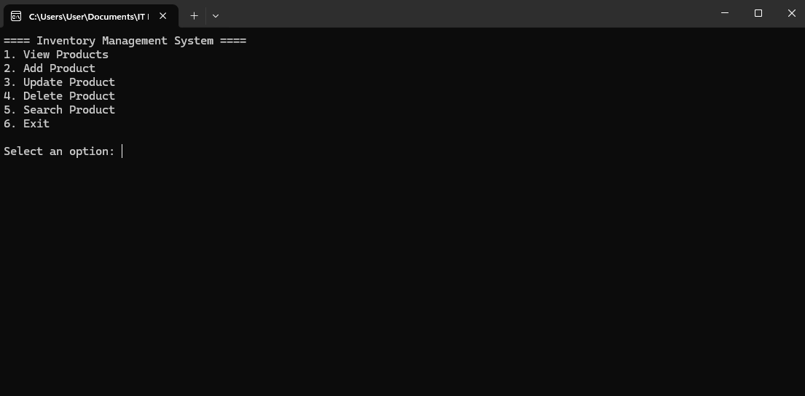
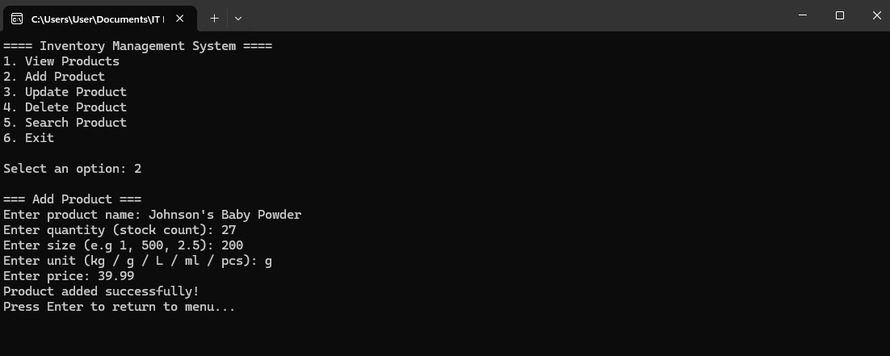
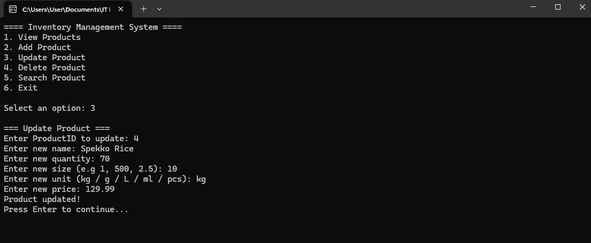
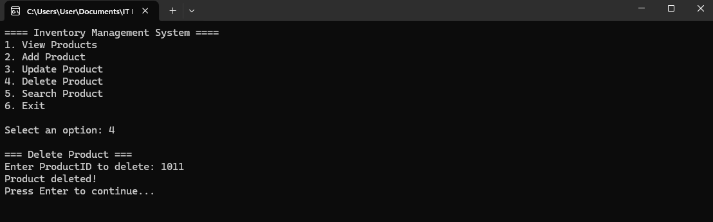
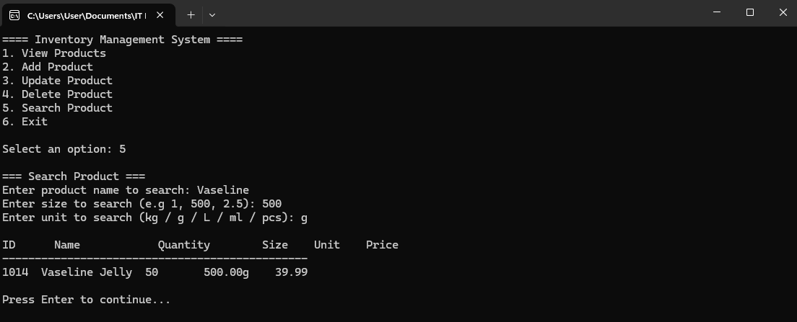

# Inventory Management System

A **console-based Inventory Management System** built using **C#** and **SQL Server**.  
This system allows users to manage products, track stock, and perform basic inventory operations from the command line.

---

## 🛠️ Tech Stack
- **Language:** C#  
- **Database:** SQL Server  
- **IDE:** Visual Studio  

---

## 📂 Project Structure

InventoryManagementSystem/
├── InventoryManagementSystem.sln
├── InventoryManagementSystem/ # Main project folder
│ └── Program.cs # Main code file
├── SQL/ # Database scripts
│ ├── CreateDatabase.sql
│ └── SeedData.sql
├── screenshots/ # Console screenshots
├── .gitignore
└── README.md


---

## 📸 Screenshots

### Main Menu


### View Products


### Add Product


### Update Product


### Delete Product


### Search Product


---

## ⚡ Features
- View all products  
- Add new products  
- Update existing products  
- Delete products  
- Search products by name, size, and unit  
- Highlight low stock products (`Quantity < 5`)  

---

## 💾 Database Setup
1. Open **SQL Server Management Studio (SSMS)**  
2. Create a new database (e.g., `InventoryDB`)  
3. Run the scripts in the `SQL/` folder:
   - `CreateDatabase.sql` → creates the `Products` table  
   - `SeedData.sql` → inserts sample products  
4. Update the connection string in `Program.cs` if needed:

```csharp
static string connectionString = @"Server=YOUR_SERVER_NAME\SQLEXPRESS;Database=InventoryDB;Trusted_Connection=True;TrustServerCertificate=True;";

🚀 How to Run

Open InventoryManagementSystem.sln in Visual Studio

Build the solution (Ctrl + Shift + B)

Run the project (F5)

Use the menu to manage inventory:

==== Inventory Management System ====
1. View Products
2. Add Product
3. Update Product
4. Delete Product
5. Search Product
6. Exit
